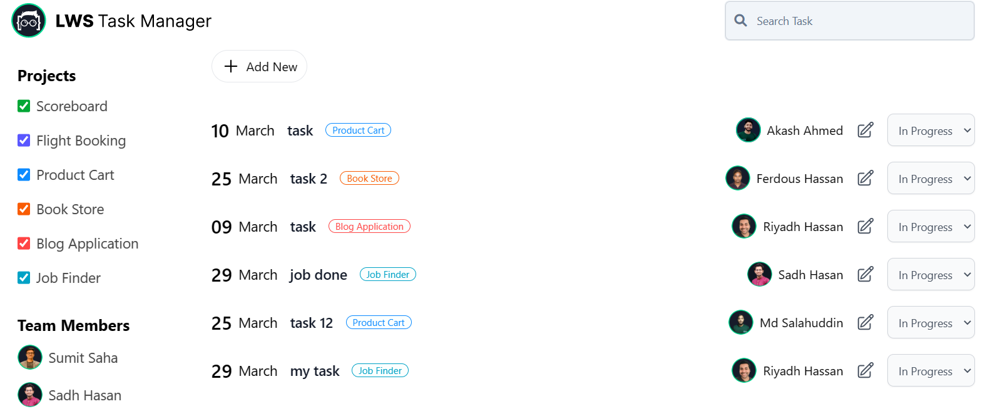
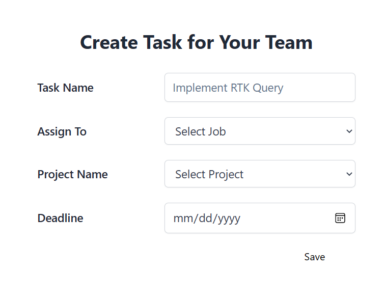

## Job Finder Application

### Live Preview [Preview](https://lws-jobfinder.netlify.app/)

### Technologies used in this application

    🠪 JavaScript
    🠪 ReactJs
    🠪 Redux-toolkit
    🠪 React router dom (for routing purposes)

### Functionality

 

✓ Fetch all the jobs from the database and render them into the home page

✓ You can sort jobs in assending or dessending order by salary and also you can search the jobs or job by the name of Job

✓ You can also add ,edit and remove jobs from the database and render them into the home page according to operations.

> **Note**
> In this project the server are used is a dummy local server.To start the server you have to download the "server" folder add install node dependency (e.x npm install) then start the server (e.x npm start).

### Web page screenshot

 

| Home Page                                                            |
| -------------------------------------------------------------------- |
|  |

| Add Page                                                | Edit Page                                                |
| ------------------------------------------------------- | -------------------------------------------------------- |
|  |  |
